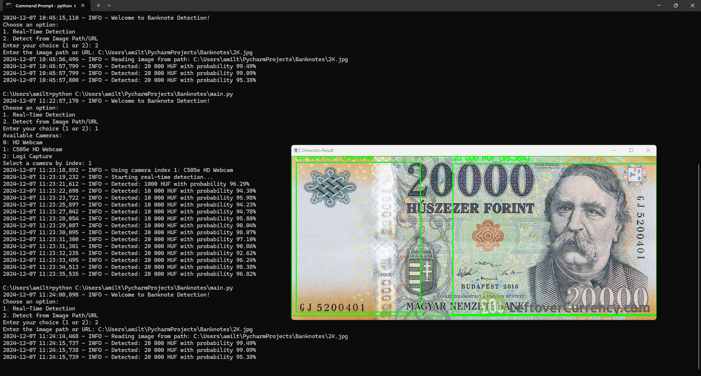
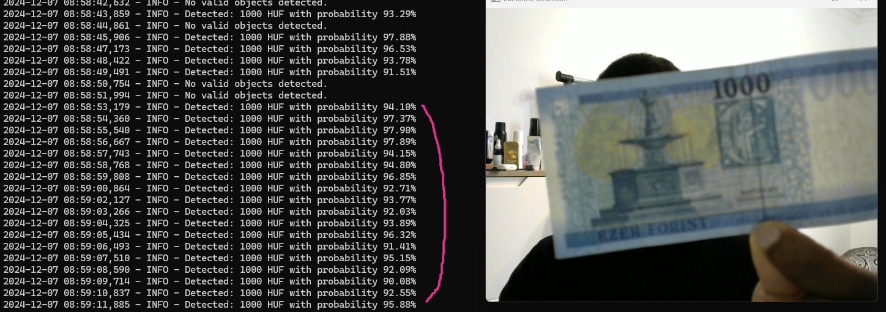

Here is the corrected and properly structured version of your text:

---

# Banknote Detection Project

This project is designed to detect and classify Hungarian banknotes (HUF) in real-time or from static images using Microsoft's Azure Custom Vision.

## Features

- Real-time detection using a webcam.
- Image-based detection from file paths or URLs.
- Highlights detected banknotes with bounding boxes and prediction probabilities.

## Prerequisites

1. **Python**: Version 3.8 or higher.
2. **Required Python Libraries**:
   - `opencv-python`
   - `requests`
   - `numpy`
   - `pygrabber`
3. **Azure Custom Vision Credentials**:
   - Training and prediction endpoints.

---

## Setup

1. **Clone the Repository**:
   ```bash
   git clone https://github.com/USERNAME/banknote-detection.git
   cd banknote-detection
   ```

2. **Create and Activate a Virtual Environment**:
   - **On Windows**:
     ```bash
     python -m venv venv
     venv\Scripts\activate
     ```
   - **On macOS/Linux**:
     ```bash
     python3 -m venv venv
     source venv/bin/activate
     ```

3. **Install Dependencies**:
   ```bash
   pip install -r requirements.txt
   ```

4. **Set Azure Custom Vision Credentials**:
   Add the required environment variables:
   - **On Windows (Command Prompt)**:
     ```cmd
     set PREDICTION_KEY=your_prediction_key
     set PREDICTION_ENDPOINT=your_prediction_endpoint
     ```
   - **On macOS/Linux**:
     ```bash
     export PREDICTION_KEY=your_prediction_key
     export PREDICTION_ENDPOINT=your_prediction_endpoint
     ```

---

## Demo

### Example 1: Banknote Detection


### Example 2: Banknote Detection


---

## Installation

1. **Clone this repository**:
   ```bash
   git clone https://github.com/amiltonkkoxi/banknote-detection.git
   cd banknote-detection
   ```

2. **Set up a virtual environment** (follow the instructions in the Setup section above).

3. **Install dependencies**:
   ```bash
   pip install -r requirements.txt
   ```

4. **Set Azure credentials**:
   Follow the instructions in the Setup section to set the necessary environment variables.

